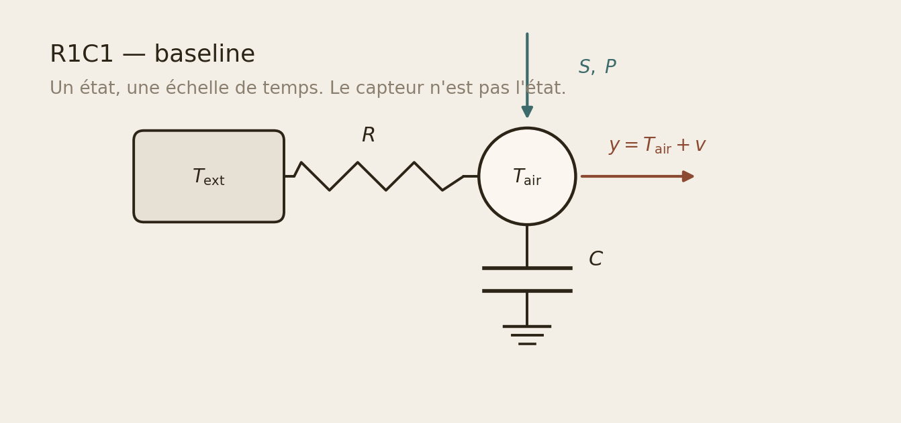
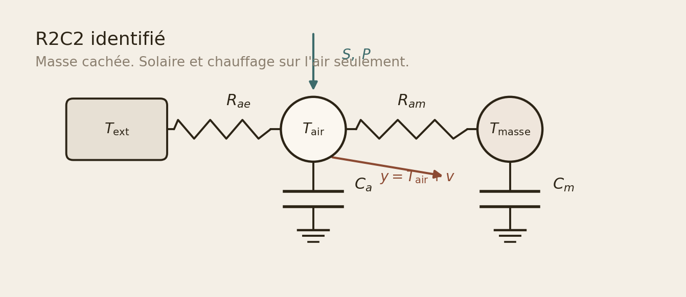
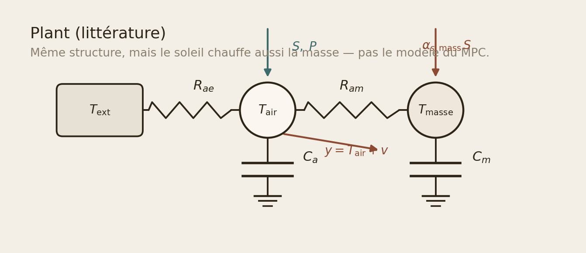

# Leçon : modèles RC, capteur, Kalman

Texte scolaire du repo. Les figures sont générées
(`python -m basic_mpc draw-schemas`). Les expériences se jouent dans
`notebooks/`. Le labo de stratégies reste Streamlit.

Vocabulaire figé : **R1C1** = baseline un état ; **R2C2** = air + masse
(identification, solaire sur l'air) ; **plant** = maison simulée pour le
MPC (solaire aussi sur la masse).

---

## 1. R1C1 — un seau d'air

Une résistance \(R\) vers l'extérieur, une capacité \(C\) (l'air, ou
tout le logement lumped en un nœud).

\[
C\,\dot T_{\mathrm{air}}
= \frac{T_{\mathrm{ext}} - T_{\mathrm{air}}}{R}
+ \alpha_S S + \alpha_P P
\]

Une seule constante de temps \(\tau = RC\). Le capteur \(y\) n'est pas
\(T_{\mathrm{air}}\) : voir §3.

Dans le code, on identifie la forme **discrète**
\(T_{k+1} = a T_k + (1-a)T_{\mathrm{ext}} + g_S S + g_P P\)
(`src/basic_mpc/models/r1c1.py`). \(P\) n'est pas en watts : c'est un
proxy. \(R\) et \(C\) ne se séparent pas.

---

## 2. R2C2 — air + masse cachée

Deux nœuds. Le capteur ne voit **que** l'air. Les murs \(T_{\mathrm{masse}}\)
sont un état caché.

\[
C_a\,\dot T_a
= \frac{T_m - T_a}{R_{am}}
+ \frac{T_e - T_a}{R_{ae}}
+ \alpha_S S + \alpha_P P
\]

\[
C_m\,\dot T_m
= \frac{T_a - T_m}{R_{am}}
\]

C'est pour ça qu'un thermostat est en retard : il réagit à l'air alors
que la chaleur est encore dans les murs.

**Plant** (littérature, `src/basic_mpc/models/plant.py`) : même circuit,
plus une flèche solaire sur la masse (\(\alpha_{s,\mathrm{mass}}\)). On
ne valide **pas** le MPC sur le RC appris sur le salon — circularité.

Les trois circuits empilés : `schema-famille-rc`.

---

## 3. Modèle de capteur

L'équation d'observation n'est pas la dynamique RC.

\[
y_k = T_{\mathrm{air},k} + v_k
\]

Ici \(v\) = bruit **et** quantification. Salon : pas de **0,1 °C**.
Extérieur : **1 °C**. Un 21,8 °C lu n'est pas un état continu.

`SensorModel` (`src/basic_mpc/data/sensors.py`) :

- `infer_resolution` lit le plus petit écart dans les CSV ;
- `quantize_measurement` projette l'état vrai sur la grille du capteur
  (c'est ce que fait le plant à chaque pas).

On **n'interprète pas** ces marches d'escalier comme une constante de
temps des murs. Un trou de 12 h reste un trou : le Kalman prédit sans
mettre à jour, il n'invente pas de mesure.

Notebook : `notebooks/02-modele-capteur.ipynb`.

---

## 4. Filtre de Kalman (à la main)

Pas de `filterpy`. Un cycle à chaque pas de 5 min :

1. **Prédiction** — le RC avance avec \(u_{k-1} = (T_{\mathrm{ext}}, S, P)\).
   Incertitude \(P\) grossit (`Q`).
2. **Innovation** — \(e_k = y_k - C\hat x^-_k\). Pour nous \(C = [1,\,0]\)
   (on compare à l'air).
3. **Mise à jour** — le gain \(K\) mélange prédiction et mesure.
   Si \(y\) est NaN : on saute 3.

R1C1 : un état, le filtre lisse le capteur. R2C2 : le deuxième état
(masse) n'est **jamais** mesuré ; Kalman l'infère via \(R_{am}\).

Innovations : si le modèle est bon, \(e_k\) ressemble à du bruit blanc
(histogramme + ACF, figure I3). La PEM minimise la NLL de ces \(e_k\).

Notebooks : `03-kalman-r1c1.ipynb`, `04-kalman-masse-cachee.ipynb`,
`06-innovations-et-nll.ipynb`.

---

## 5. Où jouer

| Support | Quoi |
|---|---|
| Cette page / GitHub | Texte + schémas |
| [Leçon Pages](https://dimiphoton.github.io/basic-MPC/simulator/) | RC interactif + mêmes schémas |
| `notebooks/` | Expériences (appellent `src/`, ne recopient pas le filtre) |
| `streamlit run webapp/app.py` | Labo météo + stratégies |
