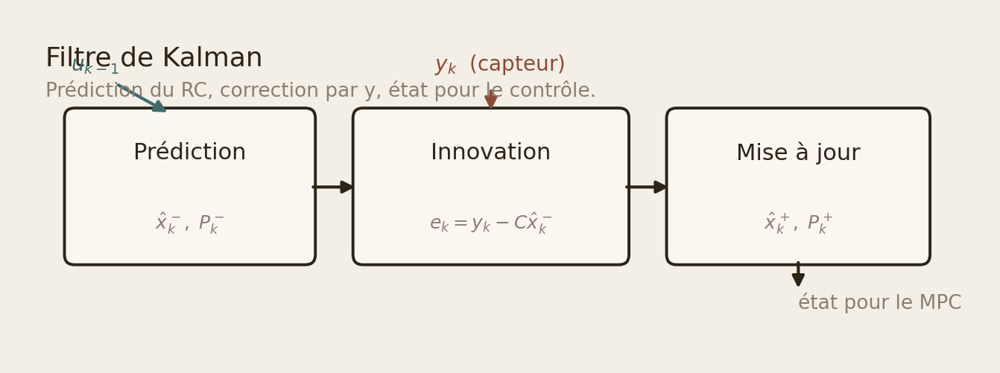
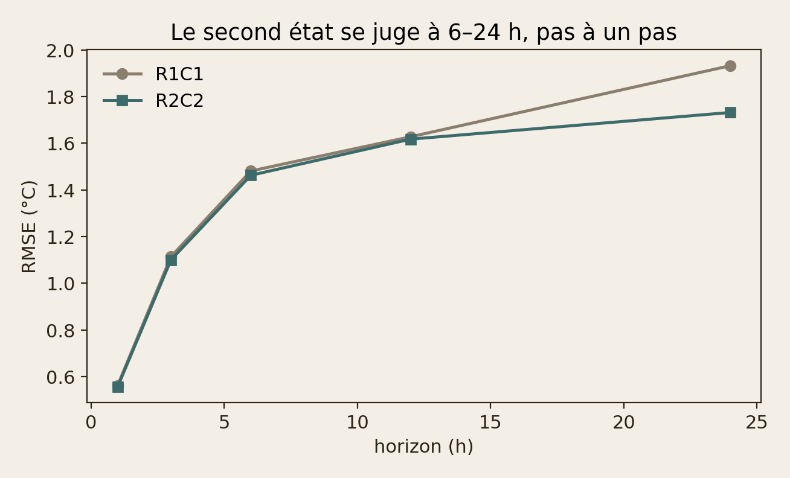
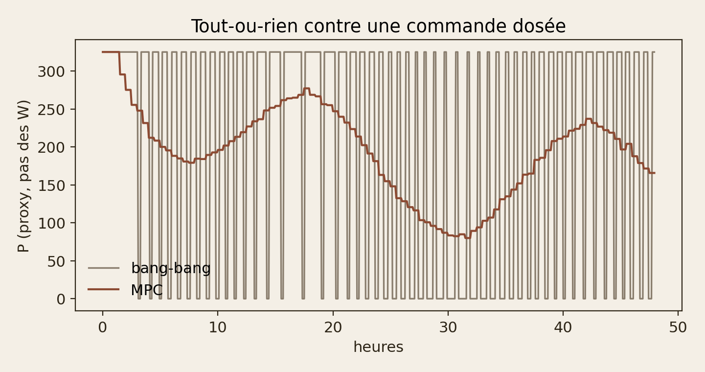

<!-- _class: cover -->
<!-- _paginate: false -->

# Un RC identifiable
# suffit-il au MPC ?

Machine learning · Bâtiment · Python / NumPy / SciPy

Maison instrumentée · 2020 · ~5 min

---

<!-- _class: split -->

# L'erreur se juge
# à 24 heures.

À un pas, R1C1 et R2C2 sont à égalité : 0,56 °C.

**À 24 h, le second état gagne 0,2 °C. C'est pour ça qu'on le garde.**

---

<!-- _class: split -->

# Le livrable
# est le contrôleur.

Pas un dashboard. Pas un rapport d'identification.

Bureaux d'études et exploitants : une commande, une bande de confort, un plant distinct.

---

<!-- _class: full -->

# Deux échelles.
# Un état caché.

L'air réagit. La masse stocke.
Le capteur ne voit que l'air, et encore : par 0,1 °C.

---

<!-- _class: split -->

# Logique du
# traitement.

Salon + extérieur, maille 5 min. Interpolation plafonnée à 10 min.

Un trou de 12 h reste un trou. Quantification 0,1 °C vs 1 °C : capteur, pas RC.

Pas de watts : `P` = écart eau/air si la zone demande, `S` = PV.

---

<!-- _class: split -->

# Ce qu'on isole.

PEM : vraisemblance des innovations Kalman, split 70/30, fit sur 50 jours d'hiver.

On retire la quantification du capteur de la dynamique.
Ce qui reste, ce sont `R`, `C` et des gains proxy.

---

<!-- _class: chart -->

## Kalman : prédire, innover, mettre à jour — à la main.

---

<!-- _class: dark -->

# Périmètre.

On identifie un RC sur capteurs réels.
On teste le MPC sur un plant littérature.

Le solaire du plant tape aussi les murs. Ce n'est pas une validation en maison.

---

<!-- _class: chart -->

## Le second état se lit après 6 h, pas au pas suivant.

---

<!-- _class: full -->

# 0 h hors bande
# après 2 h de montée.

Bang-bang : 7 h. Même météo, même plant, même graine.

---

<!-- _class: chart -->

## Tout-ou-rien contre une commande dosée sur 6 h.

---

<!-- _class: split -->

# Horizon glissant.

Six heures d'avance. Commande constante par blocs de 30 min.

Kalman à chaque pas. SciPy, pas cvxpy. Météo future connue (oracle).

---

<!-- _class: split -->

# Pas circulaire.

Même `u`, deux physiques : le plant a `α_s,mass`.

Le R2C2 maison (τ ~ 140 h) ne pilote pas ce plant.
Le modèle interne reprend la structure d'identification, sans solaire sur la masse.

---

<!-- _class: dark -->

# Pourquoi pas le R2C2 salon.

Les deux constantes de temps saturent vers 140 h.
Ce n'est pas un air rapide plus une masse.

On le dit. On ne s'en sert pas comme modèle interne du plant.

---

<!-- _class: dark -->

# Où ça casse.

Prévisions météo parfaites (oracle).

`P` n'est pas des watts.

Une maison, un hiver de fit, pas un parc.

---

<!-- _class: cta -->

# Reproduire.

[Slides](https://dimiphoton.github.io/basic-MPC/slides/presentation-technique-fr.html)
[Repo](https://github.com/dimiphoton/basic-MPC)

`python -m basic_mpc mpc-vs-bang-bang`

`pytest`

